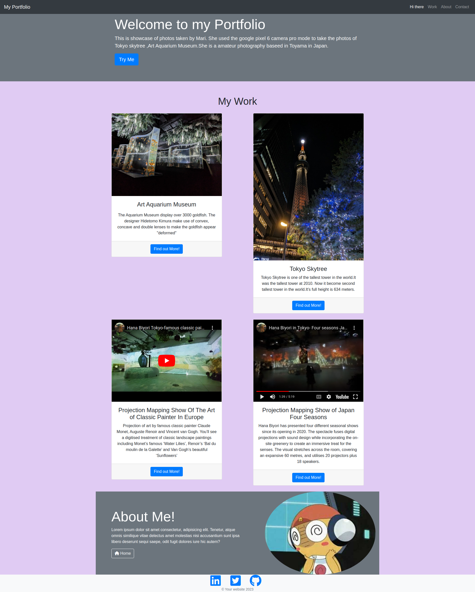

# Module-3-Challenge
# bootstrap

## Description

The assignment aim to apply the knowledge of Moduel 3 of bootcamp front end development knowledge of HTML and CSS

### The assigment made some changes as below:

* Make the website with navbar and cards with bootstrap.
  
* Add the photos and videos taken in Hana Biyori and Art Aquarium Museum in Tokyo

* Change the background color of body.

  # Installation

web browser like chrome, Edge , Firefox, Safari

Usage
Provide instructions and examples for use. Include screenshots as needed.

To add a screenshot, create an assets/images folder in your repository and upload your screenshot to it. Then, using the relative file path, add it to your README using the following syntax: prework-study-guide/assets/image

# Credit

Chungsze

https://getbootstrap.com/docs/4.6/getting-started/introduction/

The following image shows the web application's appearance and functionality:

